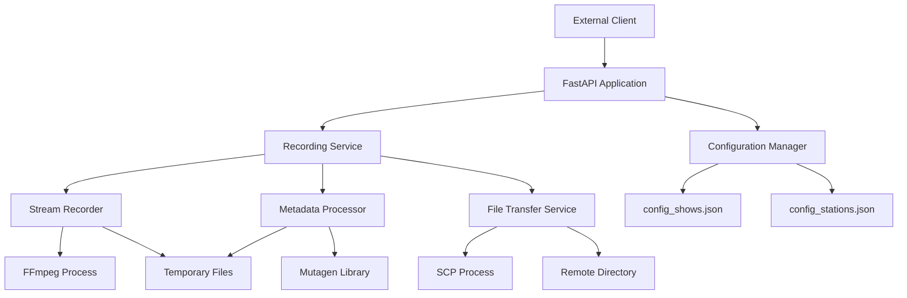

# Design Document

## Overview

The Radio Stream Recorder API is a FastAPI-based service that automates the recording, processing, and distribution of radio streams. The system accepts HTTP requests to trigger recordings, processes audio streams through ffmpeg, applies rich metadata using mutagen, and transfers completed files via SCP to remote storage locations.

The architecture follows a modular design with clear separation of concerns: API layer for request handling, service layer for business logic, and utility modules for specific operations like recording, metadata processing, and file transfer.

## Architecture

### High-Level Architecture



### Container Architecture

The application runs in a Docker container with the following mounted volumes:
- `/config` - Configuration files (read-only)
- `/work` - Temporary working directory for recordings
- `/ssh` - SSH private key for SCP authentication (read-only)
- `/etc/localtime` and `/etc/timezone` - Host timezone information

## Components and Interfaces

### API Layer

**FastAPI Application (`main.py`)**
- Handles HTTP requests and responses
- Validates request parameters
- Manages async request processing
- Provides health check endpoint

```python
class RecordRequest(BaseModel):
    show: str
    duration_minutes: int

@app.post("/record")
async def record_stream(request: RecordRequest) -> RecordResponse

@app.get("/healthz")
async def health_check() -> HealthResponse
```

### Configuration Management

**Configuration Manager (`config.py`)**
- Loads and validates JSON configuration files
- Provides thread-safe access to configuration data
- Handles configuration reload capabilities

```python
class ShowConfig:
    show: str
    station: str
    artwork_file: str
    remote_directory: str
    frequency: str  # "daily" or "weekly"
    playlist_db_slug: str

class ConfigManager:
    def load_shows_config() -> Dict[str, ShowConfig]
    def load_stations_config() -> Dict[str, str]
    def get_show_config(show_key: str) -> Optional[ShowConfig]
    def get_station_url(station_key: str) -> Optional[str]
```

### Recording Service

**Recording Orchestrator (`recorder.py`)**
- Coordinates the entire recording workflow
- Manages temporary file lifecycle
- Handles concurrent recording requests
- Implements error recovery mechanisms

```python
class RecordingService:
    async def record_show(show_key: str, duration_minutes: int) -> RecordingResult
    def _generate_unique_temp_path() -> str
    def _cleanup_temp_files(temp_path: str) -> None
```

### Stream Recording

**Stream Recorder (`stream_recorder.py`)**
- Interfaces with ffmpeg for stream capture
- Manages recording process lifecycle
- Handles stream connection errors and retries

```python
class StreamRecorder:
    async def record_stream(url: str, output_path: str, duration_minutes: int) -> bool
    def _build_ffmpeg_command(url: str, output_path: str, duration: int) -> List[str]
    def _monitor_recording_process(process: subprocess.Popen) -> bool
```

### Metadata Processing

**Metadata Processor (`metadata.py`)**
- Converts audio files to MP3 format
- Applies ID3 tags and embedded artwork
- Calculates track numbers based on frequency

```python
class MetadataProcessor:
    def process_audio_file(input_path: str, show_config: ShowConfig) -> str
    def _convert_to_mp3(input_path: str, output_path: str) -> bool
    def _apply_metadata(mp3_path: str, show_config: ShowConfig) -> None
    def _calculate_track_number(frequency: str) -> int
    def _embed_artwork(mp3_path: str, artwork_path: str) -> None
```

### File Transfer

**Transfer Service (`transfer.py`)**
- Handles SCP file transfers to remote locations
- Creates remote directory structure
- Manages SSH key authentication

```python
class TransferService:
    def transfer_file(local_path: str, show_config: ShowConfig, filename: str) -> bool
    def _build_remote_path(show_config: ShowConfig, filename: str) -> str
    def _execute_scp_command(local_path: str, remote_path: str) -> bool
```

## Data Models

### Configuration Models

```python
# Show Configuration
{
    "show": "Super Sonido",
    "station": "KUVO", 
    "artwork-file": "/home/pi/recordings/art/super-sonido.jpg",
    "remote-directory": "alwirtes@plex-server.lan:/Volumes/External_12tb/Plex/Radio\\ Rips/",
    "frequency": "weekly",
    "playlist-db-slug": "Super Sonido"
}

# Station Configuration  
{
    "KUVO": "http://kuvo-ice.streamguys.org/kuvo-aac-128"
}
```

### API Models

```python
class RecordRequest(BaseModel):
    show: str = Field(..., description="Show key from config_shows.json")
    duration_minutes: int = Field(..., gt=0, le=480, description="Recording duration in minutes")

class RecordResponse(BaseModel):
    success: bool
    message: str
    recording_id: Optional[str] = None
    estimated_completion: Optional[datetime] = None

class HealthResponse(BaseModel):
    status: str
    timestamp: datetime
    version: str
```

### File Naming and Metadata Rules

**Filename Format:** `YYYY-MM-DD Show.mp3` (using local timezone)

**MP3 Metadata Tags:**
- Artist: `show` value from configuration
- Album Artist: `show` value from configuration  
- Album: `show` + current year (e.g., "Super Sonido 2024")
- Track Number: Calculated based on frequency
  - Daily: Days since January 1st
  - Weekly: Weeks since January 1st
- Date: Current date in YYYY-MM-DD format
- Embedded Artwork: From `artwork-file` path

**Remote Directory Structure:**
```
<remote-directory>/<show>/<Album>/<YYYY-MM-DD Show>.mp3
```

## Error Handling

### Error Categories and Responses

1. **Configuration Errors (400 Bad Request)**
   - Invalid show key
   - Missing configuration files
   - Malformed JSON configuration

2. **Stream Recording Errors (502 Bad Gateway)**
   - Stream URL unreachable
   - Network connectivity issues
   - ffmpeg process failures

3. **File Processing Errors (500 Internal Server Error)**
   - Audio conversion failures
   - Metadata application errors
   - File system permission issues

4. **Transfer Errors (502 Bad Gateway)**
   - SCP authentication failures
   - Remote directory access issues
   - Network transfer failures

### Error Recovery Mechanisms

- **Retry Logic:** Automatic retries for transient network errors
- **Graceful Degradation:** Continue processing even if non-critical steps fail
- **Temporary File Retention:** Keep temp files on transfer failure for manual recovery
- **Detailed Logging:** Comprehensive error logging for troubleshooting

## Testing Strategy

### Unit Testing
- Configuration loading and validation
- Metadata calculation logic (track numbers, filename generation)
- Error handling for each component
- Mock external dependencies (ffmpeg, scp)

### Integration Testing
- End-to-end recording workflow with test streams
- Configuration file parsing with various scenarios
- SCP transfer with test remote directories
- Docker container health checks and startup

### Performance Testing
- Concurrent recording request handling
- Memory usage during long recordings
- Disk space management for temporary files
- Network bandwidth utilization

### Security Testing
- SSH key permission validation
- Input sanitization for show parameters
- Container security scanning
- File system access restrictions

## Deployment Configuration

### Docker Configuration

**Environment Variables:**
- `TZ`: Timezone (default: America/Denver)
- `APP_CONFIG_DIR`: Configuration directory path
- `APP_WORK_DIR`: Working directory for temporary files
- `APP_SSH_KEY`: SSH private key path
- `APP_PORT`: API port (default: 8000)

**Volume Mounts:**
- Configuration files (read-only)
- Working directory (read-write)
- SSH key (read-only, 600 permissions)
- Timezone information (read-only)

**Health Checks:**
- HTTP GET to `/healthz` endpoint
- 30-second intervals with 5-second timeout
- 3 retry attempts before marking unhealthy

### Security Considerations

- Non-root user execution (UID 10001)
- SSH key with restricted permissions (600)
- Read-only configuration mounts
- Network isolation through Docker networking
- Input validation and sanitization
- Secure temporary file handling with unique identifiers

### Documentation Requirements

 - A verbose README.md file will be created providing curl examples for using the API.
 - An API document will be created that can be use at a later time for other applications to utilize this API.